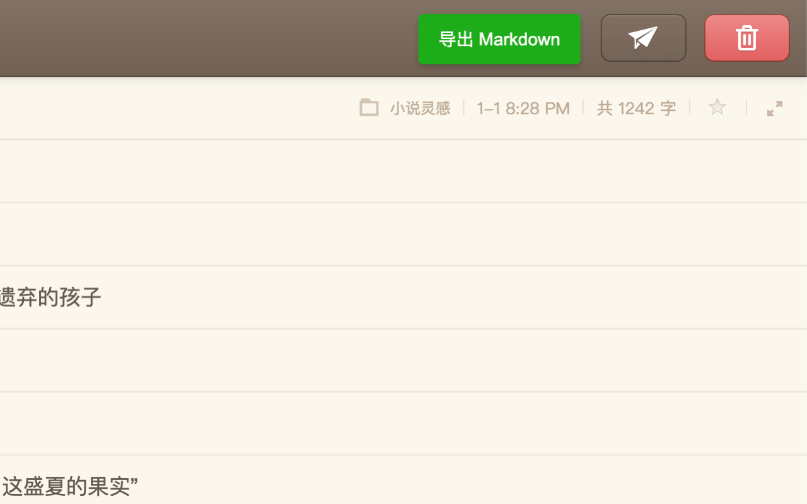

# 锤子便签导出工具

## 功能

- 从锤子便签中提取内容导出 Markdown 格式文件
- 在页面右上角提供导出按钮

## 提示
 - 当前版本只支持单个便签内容导出，多便签内容导出功能正在开发中

## 安装

1. 下载 release 文件夹中的 zip 文件
2. 在 Chrome 浏览器中，打开扩展程序页面（chrome://extensions/）。
3. 启用开发者模式。
4. 点击“加载已解压的扩展程序”，选择项目的根目录。
5. 确保扩展程序已成功加载。

## 使用

1. 打开 [锤子便签](https://yun.smartisan.com/) 页面。
2. 在页面右上角找到“导出 Markdown”按钮。
3. 点击按钮，便签内容将被提取并下载为 Markdown 文件。

## 请我喝咖啡

如果你觉得这个插件对你有帮助，可以请我喝杯咖啡！以下是我的收款二维码：

  

    <h3>微信</h3>
    
  

  

    <h3>支付宝</h3>
    
  

## 贡献

欢迎提出建议和拉取请求！
